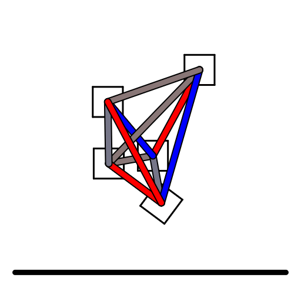

# CS 302 Final Project - Rigid Body Jumping Shape

- Author: Sebastian Myhr
- Northwestern University, CS 302: Artificial Life (Winter 2025)



## Overview
This project is a physics-based simulation using Taichi to model a jumping shape composed of multiple rigid bodies connected by springs. The simulation evolved over multiple labs, refining its structure, actuation, and optimization techniques. The success of the shape is dependent upon how long it stays in the air and the height it reaches.

## Development Progression

### Rigid Body Skeleton
- Implemented a **wheel-like structure**, where multiple rigid boxes are connected to a central hub using springs.
- Introduced **procedural spring connections**, allowing elastic movement.
- Developed core simulation functions:
  - `wheel_pattern_robot()`: Generates the shape.
  - `apply_spring_force()`: Computes spring forces.
  - `collide()`: Handles ground interactions.
- Stability was a major focus, with careful tuning of **spring stiffness and damping** to prevent instability.

### Evolutionary Optimization
- Introduced **evolutionary optimization** to improve jumping height.
- Implemented a mutation-based approach:
  1. Start with different numbers of boxes.
  2. Simulate jumping.
  3. Select the best-performing structure.
  4. Mutate and iterate over generations.
- Findings:
  - Changing only the number of boxes had a **limited effect** on performance.
  - Future improvements suggested optimizing **spring stiffness and connectivity** instead.

### Actuation and Control
- Implemented **open-loop control** using sinusoidal actuation patterns.
- Applied **predefined oscillations** to springs, improving jump height and duration.
- Challenges:
  - **Numerical instability** due to extreme forces (fixed with damping and parameter tuning).
  - **Parameter tuning** required to balance stiffness, actuation strength, and oscillation phase.
- Results:
  - The robot stayed in the air **longer** and **jumped higher** than previous versions.
  - Actuation played a key role in sustaining momentum.

### Connecting Outer Boxes
- **New structural connectivity**: Previously, outer boxes were only attached to the center.
- Added **direct spring connections** between outer boxes, stabilizing the structure.
- Adjusted **spring stiffness and damping** to prevent instability.
- The simulation is now more **cohesive and dynamic**, making movements smoother and more controlled.

## How to Run
```sh
python 302Final.py 0 train
```
